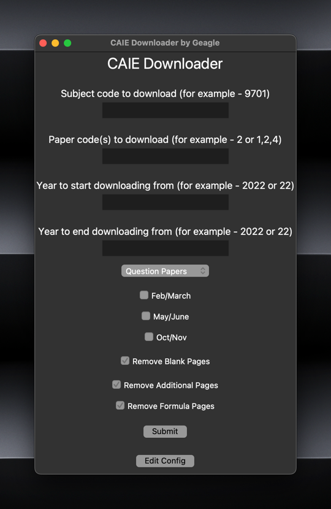

<div align="center">
  <h1>CAIE Downloader </h1>
  <p>
    <b>A simple Python-based utility tool which can be used to download and compile CAIE (IGCSEs, O Levels, and A Level) past papers.</b>
    <br/>
    <br/>
    
    
    
  </p>
</div>

This project provides a simple GUI-based utility tool which allows students of the CAIE high school curriculum (IGCSEs, O Levels, AS and A Levels) to download past papers and compile them into a single PDF file, which can then be printed, solved on a tablet, or used in any other way. The tool allows you to customize:

* The **subject code** being downloaded (_e.g. 9701_)
* The **paper code(s)** being downloaded (_e.g. 1,2,4_)
* The **years** for which papers are to be downloaded (_e.g. 2020-23_)
* The **exam series** for which to download papers (_e.g. Feb/March_)

You can also automatically remove **blank pages**, **additional pages**, and **formula pages** if you wish! Downloading mark schemes is also possible simply through a dropdown.

You can also set your default download directory, and your default settings for blank, additional and formula pages, by clicking "Edit Config".

When run, the program produces a simple, elegant and intuitive GUI window, where you can enter the details of what you would like to download. The file will automatically be created and output to the directory which you pick during the file selection menu which pops up after downloading is finished.

<div align="center">

</div>


### Download the [latest program release](https://github.com/itsgeagle/caiedownloader/releases/latest/)!

## Installation


### macOS/Linux


Open Terminal by going into `Finder -> Applications -> Utilities -> Terminal` (macOS) or by using the `CTRL + ALT + T` shortcut (Linux).

Ensure you have python installed by running:

```
python3 --version
```

If you have Python installed, this should return your local Python version. If not, you can download and install Python [here.](https://www.python.org/downloads/)

Navigate to the directory where you wish to store the files by either:
- Using the `cd /path/to/folder/` command in terminal, where `/path/to/folder` is the path to the directory.
- On macOS, navigating to the directory in Finder, then right-clicking the folder and selecting the 'New Terminal at Folder' option under 'Services'.

Download the [latest program release](https://github.com/itsgeagle/caiedownloader/releases/latest/) to that directory and unzip the file.

Alternatively, you may also get the program files from the source using git:
```
git clone https://github.com/itsgeagle/caiedownloader.git
```

Navigate into the repository folder you just created:
```
cd ./caiedownloader/
```
Note that depending on how you downloaded the files, the folder may be named `caiedownloader-beta` or  `caiedownloader-main`, in which case you should change the command above to be appropriate.

Install dependencies using the pip process manager:
```
python3 -m pip install -r requirements.txt
```

And that's it! Hopefully, if everything went right, you should be ready to use the CAIE Downloader!

To use the application, simply run the `caiedownloader.py` file using the following command:

```
python3 caiedownloader.py
```


### Windows

Open the Command Prompt by entering the Start Menu and entering `cmd`.

Ensure you have python installed by running:

```
python3 --version
```

If you have Python installed, this should return your local Python version. If you do not have Python installed, please install the latest Python version from the Microsoft Store.

Navigate to the directory where you wish to store the files by either:
- Using the `cd C:\path\to\folder\` command in Command Prompt, where `C:\path\to\folder\` is the path to the directory.
- Navigating to the directory in File Explorer, then right-clicking the folder and selecting the 'Open in Terminal' option.

Download the [latest program release](https://github.com/itsgeagle/caiedownloader/releases/latest/) to that directory and unzip the file.

Alternatively, you may also get the program files from the source using git:
```
git clone https://github.com/itsgeagle/caiedownloader.git
```

Navigate into the repository folder you just created:
```
cd .\caiedownloader\
```
Note that depending on how you downloaded the files, the folder may be named `caiedownloader-beta` or  `caiedownloader-main`, in which case you should change the command above to be appropriate.

Install dependencies using the pip process manager:
```
python3 -m pip install -r requirements.txt
```

And that's it! Hopefully, if everything went right, you should be ready to use the CAIE Downloader!

To use the application, simply run the `caiedownloader.py` file using the following command:

```
python3 caiedownloader.py
```

In the case of any bugs or issues, feel free to report them here on GitHub. Please first check if they have already been addressed over on the [Issues Tab](https://github.com/itsgeagle/caiedownloader/issues). If you have discovered a new issue/have an improvement suggestion, go ahead and create a new issue, and I will take a look at it as soon as possible.

Alternatively, for any questions, bug reports, issues, and so on, you can find me over on Discord (@thegeagle).
